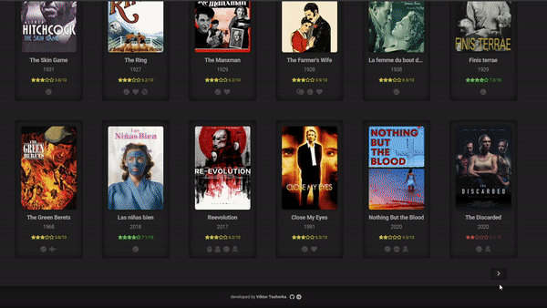

# Kino

<br/>
## Description
Kino is a simple torrents website with HD movies at the smallest file size. Based on https://yts.mx/api.
## Link
https://kino-blond.now.sh/
## Stack


<br/>

## Developing
``` shell
npm install
npm run dev
```
